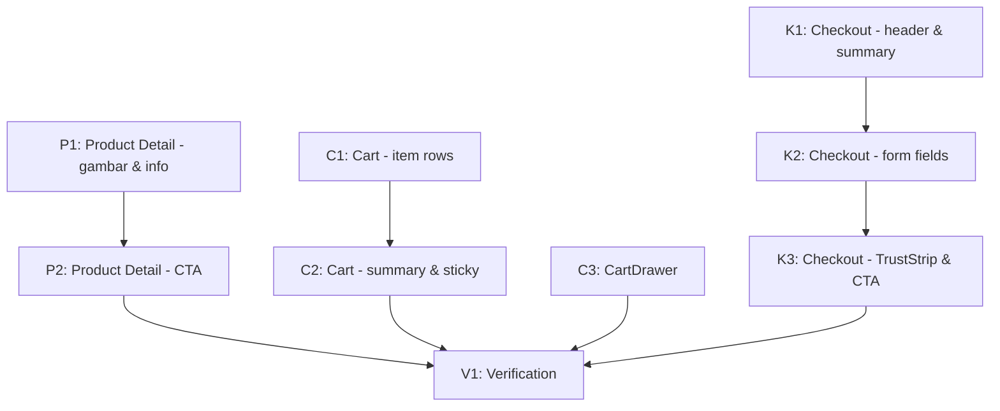

# Implementation Plan: Checkout Flow Redesign

## Overview

Redesign 4 komponen conversion flow: Product Detail, Cart Page, CartDrawer, Checkout.
Semua task depend pada `design-foundation` (fase 1) yang sudah selesai.

**Total tasks**: 10 task dalam 4 milestone.
**Estimasi total**: ~18–22 jam.

## Tasks

---

## Milestone 1: Product Detail Page

### Task P1: Refactor Product Detail — gambar, header, dan konten info

- **Status**: TODO
- **Priority**: Critical
- **Estimasi**: 3 jam
- **Dependencies**: design-foundation selesai
- **Files**: `app/products/[slug]/page.tsx` (REFACTOR)

#### Subtasks
1. Hapus import `ChevronLeft` (sudah tidak dipakai)
2. Hapus import `formatPrice` lokal — gunakan `PriceTag` dari `@/components/ui`
3. Wrap gambar produk agar edge-to-edge di mobile: `relative -mx-4` agar full bleed, `md:mx-0 md:rounded-card`
4. Hapus `grayscale` class dari gambar (`className="object-cover"`)
5. Hapus stripe accent div `<div className="h-2 bg-stripes-red-dense mt-0" />`
6. Hapus overlay "ITEM / {product.id}" di pojok gambar
7. Hapus section border merah dekoratif antar bagian gambar
8. Ganti kategori label dengan `<Eyebrow color="default">{product.category}</Eyebrow>`
9. Ganti nama produk `h2 uppercase` → `<h1 className="text-heading-1 font-bold text-text-primary mt-2 mb-3">{product.name}</h1>`
10. Ganti `formatPrice(product.price)` inline → `<PriceTag price={product.price} originalPrice={product.originalPrice} size="xl" showDiscountBadge />`
11. Hapus label "HARGA" uppercase di atas price
12. Hapus label "DESKRIPSI" uppercase — cukup `<p className="text-body text-text-secondary leading-relaxed">`
13. Hapus label "UKURAN" uppercase → `<p className="text-body-sm font-semibold text-text-primary mb-2">Ukuran</p>`
14. Hapus label "WARNA" uppercase → `<p className="text-body-sm font-semibold text-text-primary mb-2">Warna</p>`
15. Hapus label "JUMLAH" uppercase → `<p className="text-body-sm font-semibold text-text-primary mb-2">Jumlah</p>`
16. Update rating block: pakai `text-body-sm text-text-secondary` bukan `font-mono`
17. Ganti Trust signals inline → `<TrustStrip variant="compact" items={TRUST_ITEMS} />`
18. Tambahkan back button kecil menggunakan `router.back()` di atas nama produk mobile

#### Acceptance
- Gambar tidak grayscale
- Nama produk mixed case dengan text-heading-1
- Harga pakai PriceTag
- Trust signals pakai TrustStrip

---

### Task P2: Product Detail — Variant Selector dan Sticky CTA Bar

- **Status**: TODO
- **Priority**: Critical
- **Estimasi**: 2 jam
- **Dependencies**: P1
- **Files**: `app/products/[slug]/page.tsx` (MODIFY)

#### Subtasks
1. Update size pills: padding `py-3 px-4 min-h-[44px]`, radius `rounded-subtle`, border `border-border-default`, selected state `bg-brand-red border-brand-red text-white`
2. Update color pills: sama dengan size pills
3. Desktop CTA: ganti grid split dengan stack 2 buttons full width:
   - Tombol 1 (primer): `<Button variant="primary" size="lg" fullWidth>Tambah ke Keranjang</Button>`
   - Tombol 2 (sekunder): `<Button variant="secondary" size="lg" fullWidth>Beli Langsung</Button>`
4. Disabled state CTA: pakai `disabled` prop pada Button, bukan class conditional manual
5. Mobile sticky bar (`fixed bottom-16`): bersihkan styling:
   - Container: `bg-canvas border-t border-border-subtle p-3 pb-[env(safe-area-inset-bottom)]`
   - Qty stepper: `w-11 h-11` per tombol (44px), border `border-border-default`, radius `rounded-subtle`
   - Cart button: `<Button variant="secondary" className="flex-1">Keranjang</Button>`
   - Beli button: `<Button variant="primary" className="flex-[1.5]">Beli Langsung</Button>`
6. Helper text "Pilih ukuran & warna": ganti `// PILIH UKURAN & WARNA` → `<p className="text-body-sm text-text-muted text-center mt-2">Pilih ukuran dan warna terlebih dahulu</p>`

#### Acceptance
- Variant pills min 44px height
- CTA disabled state clean (menggunakan Button prop, bukan class manual)
- Helper text mixed case tanpa kode-style comment

---

## Milestone 2: Cart Page & CartDrawer

### Task C1: Cart Page — redesign item rows dan layout

- **Status**: TODO
- **Priority**: Critical
- **Estimasi**: 3 jam
- **Dependencies**: design-foundation selesai
- **Files**: `app/cart/page.tsx` (REFACTOR)

#### Subtasks
1. Hapus `useRouter` (tidak dipakai setelah header internal dihapus sebelumnya) — cek apakah masih ada, hapus jika tidak
2. Hapus index numbering div per item
3. Hapus outer `border-2 border-[#262626]` wrapper di list item
4. Ganti item row: ubah separator dari `border-b-2 border-[#262626]` → `border-b border-border-subtle`
5. Gambar item: ubah `border border-[#262626]` → `rounded-subtle bg-surface-2`
6. Nama item: ubah ke `text-body font-semibold text-text-primary mixed case` bukan uppercase
7. Varian chip (size · warna): ubah `font-mono uppercase tracking-wider` → `text-body-sm text-text-muted`
8. Harga per item: ganti `<p className="text-xs font-black text-[#dc2626] font-mono">` → `<PriceTag price={item.price} size="md" />`
9. Quantity stepper: tombol `w-11 h-11` (44px), border `border-border-default`, radius `rounded-subtle`
10. Delete button: `p-2.5` minimal tap area, `text-text-muted hover:text-error-500`
11. Empty state: hapus `bg-stripes-red`, ganti ikon container dengan `bg-surface-1 rounded-full`, teks mixed case, `<Button>Mulai Belanja</Button>`
12. Build dan pastikan cart state tetap berfungsi

---

### Task C2: Cart Page — Order Summary dan Mobile Sticky Bar

- **Status**: TODO
- **Priority**: Critical
- **Estimasi**: 2 jam
- **Dependencies**: C1
- **Files**: `app/cart/page.tsx` (MODIFY)

#### Subtasks
1. Order Summary desktop: bungkus dalam `<Card variant="default" padding="lg">`
2. Label "RINGKASAN", "SUBTOTAL", "ONGKIR", "TOTAL" (uppercase tracking lebar): ganti ke mixed case `text-body-sm font-medium text-text-secondary`
3. Total amount: ganti `font-mono tracking-tight text-[#dc2626]` → `<PriceTag price={totalWithShipping} size="lg" className="text-text-primary" />`
4. Checkout button desktop: ganti manual styling → `<Button variant="primary" size="lg" fullWidth onClick={handleCheckout}>`
5. Catatan ongkir: ganti `text-[9px] text-neutral-600` → `text-body-sm text-text-muted`
6. Mobile sticky bar: 
   - Container: `bg-canvas border-t border-border-subtle p-3`
   - Total label: `text-caption text-text-muted`
   - Total nilai: `<PriceTag price={totalWithShipping} size="md" />`
   - Checkout CTA: `<Button variant="primary" size="md">Checkout</Button>`

---

### Task C3: CartDrawer redesign

- **Status**: TODO
- **Priority**: High
- **Estimasi**: 3 jam
- **Dependencies**: design-foundation selesai
- **Files**: `components/CartDrawer.tsx` (REFACTOR)

#### Subtasks
1. Panel container: ganti `border-l-2 border-[#dc2626]` → `border-l border-border-default`
2. Header: ganti `border-b-2 border-[#dc2626]` → `border-b border-border-subtle`
3. Header title: ganti font-black uppercase → `text-heading-3 font-semibold text-text-primary`
4. Header count: ganti `[{count}]` monospace → `<Badge variant="default">{count}</Badge>`
5. Close button: ganti manual styling → `<IconButton icon={<X />} aria-label="Tutup" />`
6. Hapus index numbering per item
7. Item separator: `border-b-2 border-[#262626]` → `border-b border-border-subtle`
8. Gambar item: `border border-[#262626]` → `rounded-subtle bg-surface-2`
9. Nama item: ganti uppercase → `text-body font-medium text-text-primary mixed case`
10. Varian: ganti `font-mono uppercase` → `text-body-sm text-text-muted`
11. Qty stepper: `w-9 h-9` → `w-11 h-11` (44px), border `border-border-default`
12. Harga per item: ganti manual `font-mono` → PriceTag atau `text-body font-semibold tabular-nums`
13. Delete button: padding 44px tap area, `text-text-muted hover:text-error-500`
14. Empty state: hapus `bg-stripes-red`, mixed case, `<Button>Mulai Belanja</Button>`
15. Footer border: `border-t-2 border-[#dc2626]` → `border-t border-border-subtle`
16. Subtotal row: label mixed case, nilai `<PriceTag size="lg" />`
17. Hapus "LIHAT CART PAGE" button → ganti dengan `<Link href="/cart" className="text-body-sm text-text-muted text-center block mt-2 hover:text-text-primary">Lihat keranjang lengkap</Link>`
18. Checkout button: `<Button variant="primary" size="lg" fullWidth asChild><Link href="/checkout">Checkout Sekarang</Link></Button>`
19. Hapus "HAPUS SEMUA" button di footer (pindahkan ke menu lebih jarang diakses, atau hapus saja — terlalu mudah salah tap)

---

## Milestone 3: Checkout Page

### Task K1: Checkout — header, order summary collapsible, dan visual alignment

- **Status**: TODO
- **Priority**: Critical
- **Estimasi**: 3 jam
- **Dependencies**: design-foundation selesai
- **Files**: `app/checkout/page.tsx` (REFACTOR)

#### Subtasks
1. Checkout page sudah tidak ada BottomNav dan Footer (AppShell hide di /checkout) — pertahankan
2. Tambah minimal header baru di atas form (karena TopHeader masih ada dari AppShell):
   - `<div className="max-w-2xl mx-auto px-4 pt-5 pb-3 flex items-center gap-3">`
   - Back button: `<button onClick={() => router.back()} aria-label="Kembali"><ChevronLeft /></button>`
   - Title: `<h1 className="text-heading-2 font-bold text-text-primary">Checkout</h1>`
3. Order Summary: ganti `bg-[#161616] border border-[#262626] rounded-xl` → `<Card variant="default" padding="md">`
4. Order Summary — buat collapsible di mobile:
   - Default collapsed, tampilkan "X item · Rp {total}" dengan toggle expand
   - Expanded: list item mini seperti sekarang
   - Desktop: selalu expanded
5. Gambar item di summary: ganti `rounded-lg` → `rounded-subtle`
6. Nama item: mixed case (sudah benar di existing, pertahankan)
7. Total row di summary: ganti `text-lg font-black text-white` → `text-heading-3 font-bold text-text-primary`

---

### Task K2: Checkout — form fields pakai Input/Textarea primitive

- **Status**: TODO
- **Priority**: Critical
- **Estimasi**: 2 jam
- **Dependencies**: K1
- **Files**: `app/checkout/page.tsx` (MODIFY)

#### Subtasks
1. Section heading: Tambah `<p className="text-heading-3 font-semibold text-text-primary mb-4">Informasi Kontak</p>` di atas nama/email/HP
2. Section heading: Tambah `<p className="text-heading-3 font-semibold text-text-primary mb-4 mt-6">Alamat Pengiriman</p>` di atas alamat/kota
3. Ganti field Nama: `<Input label="Nama Lengkap" name="name" ... error={errors.name} />`
4. Ganti field Email: `<Input label="Email" type="email" inputMode="email" name="email" ... error={errors.email} />`
5. Ganti field HP: `<Input label="Nomor HP" type="tel" inputMode="tel" name="phone" ... error={errors.phone} />`
6. Ganti field Alamat: `<Textarea label="Alamat Lengkap" name="address" rows={3} ... error={errors.address} />`
7. Ganti field Kota: `<Input label="Kota / Kabupaten" name="city" ... error={errors.city} />`
8. Catatan: `<Textarea label="Catatan (opsional)" name="notes" rows={2} ... />`
9. Error container: ganti `bg-red-900/20 border border-red-600/30 text-red-400` → `bg-error-500/10 border border-error-500/30 text-error-500`
10. Label konsistensi: pastikan semua mixed case (sudah dihandle Input component via `label` prop)

---

### Task K3: Checkout — TrustStrip, CTA button, dan mobile sticky

- **Status**: TODO
- **Priority**: Critical
- **Estimasi**: 2 jam
- **Dependencies**: K2
- **Files**: `app/checkout/page.tsx` (MODIFY)

#### Subtasks
1. Tambah TrustStrip di bawah catatan, sebelum tombol:
   ```tsx
   <TrustStrip variant="compact" items={[
     { icon: <Shield />, label: "Pembayaran Aman" },
     { icon: <RotateCcw />, label: "Garansi 30 Hari" },
     { icon: <MessageCircle />, label: "Support WhatsApp" },
   ]} />
   ```
2. Tombol submit desktop: hapus `hidden md:flex` — ganti jadi tombol inline yang selalu tampil di desktop tapi TIDAK ada di mobile (mobile pakai sticky bar). Implementasi: render di luar sticky bar dengan class `hidden md:flex`? Tidak. Solusi: 1 tombol submit saja di sticky bar, tapi sticky bar juga render di desktop dengan breakpoint yang sesuai. Atau: tombol inline pakai `md:hidden` untuk hide dan sticky bar hanya mobile. Pilihan final: render tombol submit inline di semua viewport, sticky bar di mobile adalah TAMBAHAN agar mudah tap. Jadi ada 2 tombol submit: 1 inline (visible `hidden md:flex`) dan 1 di sticky bottom (visible `md:hidden`). Ini acceptable karena sama form-nya (`form="checkout-form"`).
3. Tombol submit desktop (inline): `<Button type="submit" variant="primary" size="lg" fullWidth loading={loading}>Bayar Sekarang</Button>`
4. Mobile sticky bar: container `bg-canvas border-t border-border-subtle p-4 pb-[env(safe-area-inset-bottom)]`
   - Total display: `text-body-sm text-text-muted` + `<PriceTag price={totalPrice} size="md" />`
   - Tombol: `<Button type="submit" form="checkout-form" variant="primary" size="lg" loading={loading}>Bayar Sekarang</Button>`
5. Note kecil di bawah tombol: `<p className="text-caption text-text-muted text-center">Pembayaran aman via Midtrans</p>`
6. Hapus `max-w-2xl` yang double dari container luar — pakai 1 container saja

---

## Milestone 4: Verifikasi

### Task V1: Build, typecheck, smoke test

- **Status**: TODO
- **Priority**: Critical
- **Estimasi**: 1 jam
- **Dependencies**: P1, P2, C1, C2, C3, K1, K2, K3
- **Files**: Tidak ada (verifikasi saja)

#### Subtasks
1. Run `npm run build` → harus SUCCESS
2. Run `npx tsc --noEmit` → harus zero errors
3. Run `npx eslint app/products app/cart app/checkout components/CartDrawer.tsx` → zero errors di file yang diubah
4. Manual smoke test di dev mode:
   - [ ] Buka product detail → tidak ada grayscale → pilih ukuran + warna → sticky bar muncul → tap Cart → drawer terbuka → tap Beli → ke checkout
   - [ ] Buka `/cart` → tambah dari product detail → qty stepper bekerja → hapus item → empty state bersih → checkout button → ke checkout
   - [ ] Buka CartDrawer dari TopHeader → edit qty → tap Checkout → ke `/checkout`
   - [ ] Isi form checkout → validasi muncul → submit → Midtrans popup atau error message
   - [ ] Test di mobile viewport (375px width di DevTools) → semua sticky bar tidak overlap BottomNav
5. Verifikasi visual di Chrome DevTools mobile (Pixel 7, 360×800):
   - Product Detail: gambar edge-to-edge, sticky bar di atas BottomNav, tidak ada double header
   - Cart: spacing normal, sticky bar clearance
   - Checkout: form dapat di-scroll, tidak ada BottomNav (AppShell hide), tombol bayar visible

---

## Task Dependency Graph

Tasks dieksekusi dalam wave. Dalam satu wave bisa paralel.

```json
{
  "waves": [
    {
      "id": 1,
      "name": "Product Detail",
      "tasks": ["P1"],
      "description": "Refactor gambar, konten, dan info section"
    },
    {
      "id": 2,
      "name": "Product Detail CTA + Cart Items",
      "tasks": ["P2", "C1"],
      "description": "P2 lanjutan dari P1. C1 bisa paralel karena file berbeda."
    },
    {
      "id": 3,
      "name": "Cart Summary + CartDrawer",
      "tasks": ["C2", "C3"],
      "description": "C2 depend C1. C3 independent, bisa paralel dengan C2."
    },
    {
      "id": 4,
      "name": "Checkout",
      "tasks": ["K1"],
      "description": "Mulai refactor checkout setelah cart selesai untuk visual konsistensi"
    },
    {
      "id": 5,
      "name": "Checkout Form + CTA",
      "tasks": ["K2", "K3"],
      "description": "K2 depend K1. K3 depend K2."
    },
    {
      "id": 6,
      "name": "Verification",
      "tasks": ["V1"],
      "description": "Build, typecheck, smoke test semua flow"
    }
  ]
}
```

### Visual Dependency



## Notes

### Pendekatan Implementasi

Tidak ada komponen baru yang dibuat di fase ini. Semua task adalah refactor visual — pakai primitives dari `components/ui` yang sudah ada. Ini menjaga scope kecil dan risiko rendah.

### Prioritas Eksekusi

Jika hanya bisa mengerjakan sebagian:
1. K1 + K2 + K3 dulu (checkout adalah conversion paling critical dan paling inconsistent secara visual sekarang)
2. Lalu C3 (CartDrawer terlihat setiap tap cart, high visibility)
3. Lalu P1 + P2 (product detail juga penting tapi sudah lebih acceptable secara visual)
4. Lalu C1 + C2 (cart page diakses lebih jarang dari drawer)

### Kriteria Done Fase 2

- ✅ Semua task V1 lulus
- ✅ Product Detail: no grayscale, mixed case, TrustStrip, sticky CTA bersih
- ✅ Cart Page: design tokens, no index, qty 44px, Card summary
- ✅ CartDrawer: konsisten, single CTA, no index
- ✅ Checkout: visual konsisten, Input/Textarea primitives, TrustStrip, CTA visible
- ✅ Midtrans flow masih berfungsi
- ✅ Lanjut ke fase 3: discovery-redesign
