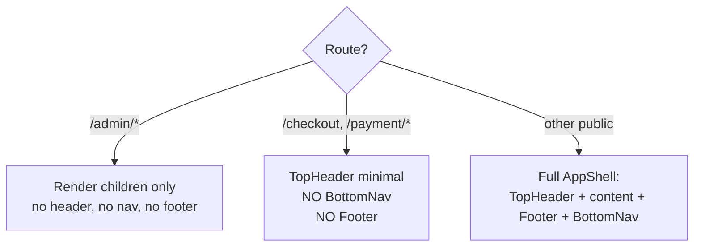
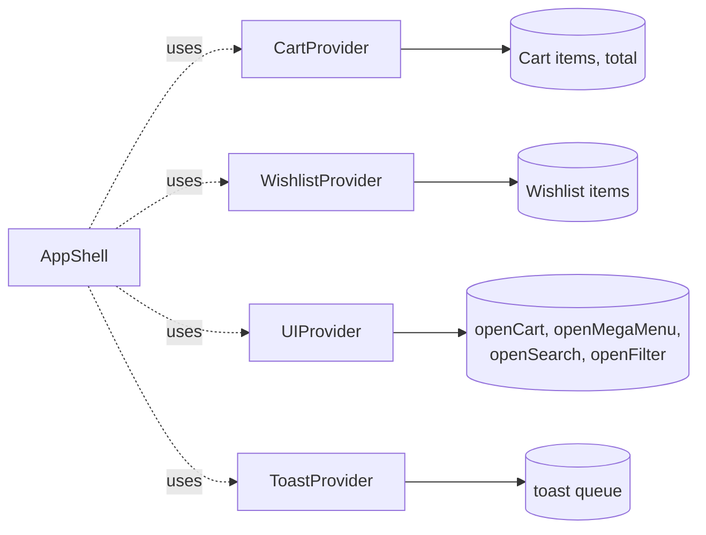

# Design Document — Design Foundation

## Overview

Spec ini adalah fase pertama dari redesign menyeluruh NXTY Fightwear menuju gaya premium-minimal photography-led. Output spec ini menjadi pondasi untuk 3 fase berikutnya (checkout-flow-redesign, discovery-redesign, editorial-pages-redesign).

Filosofi pergeseran:

| Sebelum (brutalist loud) | Sesudah (premium minimal) |
|--------------------------|---------------------------|
| Uppercase + tracking lebar di mana-mana | Mixed case, uppercase hanya untuk eyebrow kecil |
| Border merah 2px sebagai utility | Border subtle 1px, merah hanya untuk CTA & promo |
| Marquee strip, stripes background, angka 01–35 | Whitespace, fokus pada konten |
| font-mono untuk teks non-teknis | Inter konsisten, tabular-nums untuk harga |
| Multiple CTA sejajar per layar | Satu CTA primer per viewport |

## Architecture

### Folder Architecture Baru

```
components/
├── ui/                              # UI primitives (NEW folder)
│   ├── Button.tsx
│   ├── Input.tsx
│   ├── Textarea.tsx
│   ├── Card.tsx
│   ├── Badge.tsx
│   ├── Sheet.tsx                    # refactor dari components/Sheet.tsx
│   ├── Dialog.tsx
│   ├── Eyebrow.tsx
│   ├── PriceTag.tsx
│   ├── IconButton.tsx
│   ├── Skeleton.tsx                 # refactor dari components/Skeleton.tsx
│   └── index.ts                     # barrel export
│
├── navigation/                      # Navigation system (NEW folder)
│   ├── TopHeader.tsx                # ganti Navbar.tsx
│   ├── BottomNav.tsx                # refactor in-place dari components/BottomNav.tsx, lalu pindah
│   ├── MegaMenuSheet.tsx
│   ├── SearchModal.tsx              # desktop search modal
│   ├── MobileSearchSheet.tsx        # pindah dari components/MobileSearchSheet.tsx
│   └── UserMenu.tsx                 # extracted dari Navbar.tsx lama
│
├── Footer.tsx                       # NEW (ganti footer inline di page.tsx)
├── NewsletterSignup.tsx             # NEW
├── TrustStrip.tsx                   # NEW (reusable, akan dipakai fase 2)
├── AppShell.tsx                     # refactor
│
├── (existing components tetap di root dulu, akan dipindah/dihapus di fase berikutnya)
└── admin/                           # tidak diubah
```

### Component Hierarchy

```mermaid
graph TD
    AppShell --> TopHeader
    AppShell --> Children[Page Content]
    AppShell --> Footer
    AppShell --> BottomNav
    AppShell --> Overlays[Overlay Layer]

    Overlays --> CartDrawer
    Overlays --> MegaMenuSheet
    Overlays --> SearchModal
    Overlays --> MobileSearchSheet
    Overlays --> Toast

    TopHeader --> Logo
    TopHeader --> SearchField[Search Input persisten mobile]
    TopHeader --> NavLinks[Desktop nav links]
    TopHeader --> ActionIcons[Cart, User, Wishlist]
    TopHeader --> UserMenu

    BottomNav --> Tab_Beranda
    BottomNav --> Tab_Belanja[opens MegaMenuSheet]
    BottomNav --> Tab_Wishlist
    BottomNav --> Tab_Keranjang[opens CartDrawer]
    BottomNav --> Tab_Akun

    Footer --> FooterColumns
    Footer --> NewsletterSignup
    Footer --> SocialIcons
    Footer --> PaymentLogos
    Footer --> LegalLinks
```



### Navigation Flow Mobile

```mermaid
flowchart LR
    Home((Home)) -- Tap Beranda --> Home
    Home -- Tap Belanja --> MegaMenu[Mega Menu Sheet]
    MegaMenu -- Pilih kategori --> Listing[/koleksi/:kategori/]
    MegaMenu -- Tap Lihat semua --> AllProducts[/products/]
    Home -- Tap Search --> SearchSheet[Search persisten / Sheet]
    Home -- Tap Wishlist --> WishlistPage[/wishlist/]
    Home -- Tap Keranjang --> CartDrawer[Cart Drawer]
    CartDrawer -- Tap Checkout --> Checkout[/checkout/ - hide BottomNav]
    Home -- Tap Akun guest --> Login[/masuk/]
    Home -- Tap Akun logged in --> Account[/akun/]
```

### Conditional Rendering AppShell



### State Management



### Design System Overview

| Token Group | Total | Notes |
|-------------|-------|-------|
| Colors | 24 | Brand 3 + Neutral 11 + Semantic 4 × 2 shades + Surface 2 |
| Typography | 11 | display-1, display-2, h1, h2, h3, body-lg, body, body-sm, caption, eyebrow, mono |
| Spacing | 9 | tier 0–8 mengikuti Tailwind 4px scale |
| Radius | 4 | 0, sm (4), md (8), full |
| Motion | 6 | duration ×3, easing ×3 |
| Shadow | 4 | none, sm, md, lg (dark theme) |
| Breakpoints | 4 | sm 640, md 768, lg 1024, xl 1280 (Tailwind default) |

## Components and Interfaces

### Color Tokens

Lokasi: `tailwind.config.ts` (extend theme.colors) dan/atau `app/globals.css` (CSS variables).

```
Brand:
  brand-black    #0a0a0a   (canvas utama)
  brand-white    #ffffff   (konten utama)
  brand-red      #dc2626   (CTA primer, promo, urgency)
  brand-red-hover #b91c1c  (hover state untuk red CTA)

Neutral (untuk surface & text, dark theme):
  neutral-50     #fafafa
  neutral-100    #f5f5f5
  neutral-200    #e5e5e5
  neutral-300    #d4d4d4
  neutral-400    #a3a3a3   (text secondary)
  neutral-500    #737373   (text muted)
  neutral-600    #525252
  neutral-700    #404040   (border subtle on dark)
  neutral-800    #262626   (surface elevated 1)
  neutral-900    #171717   (surface elevated 2)
  neutral-950    #0a0a0a   (canvas, alias brand-black)

Semantic:
  success-500    #16a34a
  success-600    #15803d   (hover)
  warning-500    #ca8a04
  warning-600    #a16207
  error-500      #ef4444
  error-600      #dc2626   (sama dengan brand-red, intentional)

Surface aliases:
  bg-canvas      = neutral-950
  bg-surface-1   = neutral-900
  bg-surface-2   = neutral-800
  border-subtle  = neutral-800
  border-default = neutral-700
  border-strong  = neutral-500
  text-primary   = white
  text-secondary = neutral-300
  text-muted     = neutral-500
```

**Aturan pakai brand-red:**
- ✅ Tombol CTA primer (Beli, Checkout, Bayar, Subscribe)
- ✅ Badge promo aktif dengan persentase diskon
- ✅ Harga sale (opsional, atau pakai putih dengan original price coret)
- ✅ Status urgency (stok rendah, countdown timer)
- ✅ Active state pada navigation (underline atau indicator, BUKAN background full)
- ❌ Border dekoratif kotak/divider
- ❌ Ikon biasa (pakai neutral)
- ❌ Eyebrow label kategori (pakai neutral-400 atau white)
- ❌ Brand logo treatment (logo asli punya merahnya sendiri)

### Typography Scale

Font: Inter (existing via next/font). Hapus penggunaan font-mono di context non-teknis.

| Token | Mobile | Desktop | Weight | Line | Tracking | Pemakaian |
|-------|--------|---------|--------|------|----------|-----------|
| display-1 | 40px | 64px | 800 | 0.95 | -0.02em | Hero headline utama |
| display-2 | 32px | 48px | 800 | 1.0 | -0.02em | Section hero, page title besar |
| heading-1 | 24px | 32px | 700 | 1.15 | -0.01em | Page title biasa |
| heading-2 | 20px | 24px | 700 | 1.2 | -0.005em | Section heading |
| heading-3 | 18px | 20px | 600 | 1.3 | 0 | Sub-section, card title |
| body-lg | 17px | 18px | 400 | 1.6 | 0 | Lead paragraph |
| body | 15px | 16px | 400 | 1.6 | 0 | Body default |
| body-sm | 13px | 14px | 400 | 1.5 | 0 | Helper text, caption |
| caption | 12px | 12px | 500 | 1.4 | 0 | Metadata, timestamp |
| eyebrow | 11px | 11px | 600 | 1.2 | 0.08em uppercase | Kicker label di atas heading |
| price | 16px / 24px / 32px | 18px / 28px / 36px | 800 tabular | 1.1 | -0.01em | PriceTag sizes (md, lg, xl) |

**Aturan typography:**
- Default mixed case untuk semua heading dan body
- Uppercase hanya untuk: eyebrow (label < 12ch), badge, button label kecil
- Letter-spacing 0.08em maksimum untuk uppercase, jangan 0.25em+
- Tracking-tighter (-0.02em) hanya untuk display sizes
- Tabular numeric (`tabular-nums`) untuk semua harga
- Hilangkan kelas `font-black` (900) — turunkan ke `font-extrabold` (800)

### Spacing Scale

| Token | Value | Pemakaian |
|-------|-------|-----------|
| space-0 | 0 | reset |
| space-1 | 4px | gap kecil inline |
| space-2 | 8px | gap antar text element |
| space-3 | 12px | gap antar card kecil |
| space-4 | 16px | container padding mobile, card internal |
| space-5 | 20px | card internal medium |
| space-6 | 24px | section gap kecil, container desktop |
| space-8 | 32px | section gap medium |
| space-12 | 48px | section padding mobile |
| space-16 | 64px | section padding desktop |
| space-20 | 80px | section hero padding |
| space-24 | 96px | section hero padding besar |

Semantic aliases:
- `container-x-mobile` = space-4 (16px)
- `container-x-desktop` = space-8 (32px)
- `section-y-mobile` = space-12 (48px)
- `section-y-desktop` = space-20 (80px)

### Radius Scale

| Token | Value | Pemakaian |
|-------|-------|-----------|
| radius-none | 0 | brand voice sharp (image, card outline) |
| radius-sm | 4px | input, small button, badge |
| radius-md | 8px | card, dialog, sheet handle |
| radius-full | 9999px | pill, avatar, icon button bulat |

**Aturan radius:**
- Default komponen: `radius-sm` (4px) untuk feel premium tanpa kehilangan brand voice
- Image dan product card: `radius-none` (sharp) untuk editorial feel
- Pill nav, badge stat: `radius-full`
- Hindari `rounded-xl` (12px) yang generik

### Motion Tokens

| Token | Value |
|-------|-------|
| duration-fast | 150ms |
| duration-normal | 200ms |
| duration-slow | 300ms |
| ease-out | cubic-bezier(0.16, 1, 0.3, 1) |
| ease-in | cubic-bezier(0.7, 0, 0.84, 0) |
| ease-in-out | cubic-bezier(0.65, 0, 0.35, 1) |

Aturan:
- Enter animation: `duration-normal` + `ease-out`
- Exit animation: `duration-fast` + `ease-in`
- Hover transition: `duration-fast` + `ease-out`
- Page/sheet transition: `duration-slow` + `ease-out`
- `@media (prefers-reduced-motion: reduce)` → semua duration 0ms

### Shadow / Elevation

| Token | Value | Pemakaian |
|-------|-------|-----------|
| shadow-none | none | default |
| shadow-sm | 0 1px 2px rgba(0,0,0,0.5) | card subtle |
| shadow-md | 0 4px 16px rgba(0,0,0,0.6) | sticky bar, dropdown |
| shadow-lg | 0 16px 48px rgba(0,0,0,0.7) | dialog, drawer |

### UI Primitive Components

#### Button (`components/ui/Button.tsx`)

```typescript
type ButtonProps = {
  variant?: "primary" | "secondary" | "ghost" | "destructive";
  size?: "sm" | "md" | "lg";
  leftIcon?: React.ReactNode;
  rightIcon?: React.ReactNode;
  loading?: boolean;
  fullWidth?: boolean;
  asChild?: boolean; // wrap Link
  disabled?: boolean;
  children: React.ReactNode;
  onClick?: () => void;
  type?: "button" | "submit" | "reset";
  "aria-label"?: string;
};
```

| Variant | Background | Text | Border | Hover |
|---------|-----------|------|--------|-------|
| primary | brand-red | white | none | brand-red-hover |
| secondary | transparent | white | 1px white | bg white, text black |
| ghost | transparent | neutral-300 | none | text white |
| destructive | error-500 | white | none | error-600 |

| Size | Height | Padding-x | Text | Min-tap |
|------|--------|-----------|------|---------|
| sm | 32px | 12px | body-sm 13px | 44×44 via padding |
| md | 44px | 16px | body 15px | 44×44 ✓ |
| lg | 56px | 24px | body-lg 17px | 56×56 ✓ |

States: loading menampilkan Spinner di leftIcon slot + disable klik. Disabled visual: opacity-50 + cursor-not-allowed. Focus: outline 2px brand-red offset 2px.

#### Input (`components/ui/Input.tsx`)

```typescript
type InputProps = React.InputHTMLAttributes<HTMLInputElement> & {
  label?: string;
  error?: string;
  hint?: string;
  leftIcon?: React.ReactNode;
  rightIcon?: React.ReactNode;
  size?: "md" | "lg";
};
```

Visual:
- Background: `bg-surface-1` (neutral-900)
- Border: 1px `border-default`, focus 1px `brand-red`, error 1px `error-500`
- Radius: `radius-sm`
- Padding: md=12×16, lg=16×20
- Label: caption neutral-400, mb 6px
- Helper/error: body-sm, mt 4px

#### Card (`components/ui/Card.tsx`)

```typescript
type CardProps = {
  variant?: "default" | "elevated" | "outlined";
  padding?: "none" | "sm" | "md" | "lg";
  children: React.ReactNode;
  className?: string;
};
```

Default: `bg-surface-1`, border `border-subtle`, radius `radius-md`. Elevated: + `shadow-md`. Outlined: transparent bg, border `border-default`.

#### Badge (`components/ui/Badge.tsx`)

```typescript
type BadgeProps = {
  variant?: "default" | "promo" | "new" | "success" | "warning";
  size?: "sm" | "md";
  children: React.ReactNode;
};
```

Variants:
- default: `bg-surface-2`, text neutral-300
- promo: `bg-brand-red`, text white (untuk -X%)
- new: `border brand-red`, text brand-red
- success: `bg-success-500/20`, text success-500
- warning: `bg-warning-500/20`, text warning-500

#### Sheet (`components/ui/Sheet.tsx`)

```typescript
type SheetProps = {
  open: boolean;
  onClose: () => void;
  side?: "bottom" | "right" | "fullscreen";
  title?: string;
  footer?: React.ReactNode;
  size?: "sm" | "md" | "lg" | "full";
  children: React.ReactNode;
};
```

Behavior:
- Backdrop: `bg-black/60` dengan backdrop-blur
- Animation: slide from `side` dengan `duration-slow ease-out`
- Mobile bottom sheet: swipe-down to close (threshold 80px)
- Trap focus, ESC to close, restore focus saat tertutup
- Body scroll lock saat open

#### Dialog (`components/ui/Dialog.tsx`)

Modal centered, max-width responsive, untuk konfirmasi, size guide, dll. Props mirip Sheet tapi tanpa side.

#### Eyebrow (`components/ui/Eyebrow.tsx`)

```typescript
type EyebrowProps = {
  children: React.ReactNode;
  color?: "default" | "red";
};
```

Visual: `text-[11px] uppercase tracking-[0.08em] font-semibold`. Color default: neutral-400. Color red: brand-red.

#### PriceTag (`components/ui/PriceTag.tsx`)

```typescript
type PriceTagProps = {
  price: number;
  originalPrice?: number;
  size?: "md" | "lg" | "xl";
  showDiscountBadge?: boolean;
};
```

Format IDR via `Intl.NumberFormat("id-ID", { style: "currency", currency: "IDR", minimumFractionDigits: 0 })`. Font: tabular-nums, weight 800. Jika ada originalPrice dan lebih besar dari price → tampilkan coret kecil di sebelah + opsional badge promo.

#### IconButton (`components/ui/IconButton.tsx`)

```typescript
type IconButtonProps = {
  icon: React.ReactNode;
  size?: "sm" | "md" | "lg";
  variant?: "ghost" | "solid" | "outline";
  "aria-label": string; // required
  onClick?: () => void;
  badge?: number;
};
```

| Size | Dimension |
|------|-----------|
| sm | 32×32 (untuk power user, harus dalam container 44×44) |
| md | 40×40 |
| lg | 44×44 ✓ default |

#### Skeleton (`components/ui/Skeleton.tsx`)

Refactor dari `components/Skeleton.tsx` lama. Pakai gradient animasi `bg-surface-1` → `bg-surface-2`. Variant: text, circle, rectangle. Respect prefers-reduced-motion.

### Navigation Components

#### TopHeader (`components/navigation/TopHeader.tsx`)

Mobile (56px):
```
[Logo 32×32]  [────── Search Input persisten ──────]  [Cart 44×44 + badge]
```

Desktop (72px):
```
[Logo full]  [Belanja ▾  Promo  Cerita  Kontak]  [Search] [Wishlist] [User] [Cart]
```

Props:
```typescript
type TopHeaderProps = {
  autoHide?: boolean; // default true
};
```

Behavior:
- Sticky top dengan `backdrop-blur-md bg-canvas/80` saat user scroll
- Auto-hide: translate-y-full saat scroll down > 80px, translate-y-0 saat scroll up
- Mobile search field langsung tap-able (bukan toggle); click → buka MobileSearchSheet dengan keyboard fokus
- Desktop: Belanja hover → buka MegaMenuSheet dropdown, search icon click → SearchModal
- Cart icon: badge count via CartContext, click → openCart()
- User icon: dropdown UserMenu (logged in: Akun/Pesanan/Alamat/Logout, guest: Masuk)
- Wishlist icon: badge count via WishlistContext, link `/wishlist`

#### BottomNav (`components/navigation/BottomNav.tsx`)

Refactor dari `components/BottomNav.tsx`. Final lokasi: `components/navigation/BottomNav.tsx`.

```typescript
type BottomNavItem = {
  key: "beranda" | "belanja" | "wishlist" | "keranjang" | "akun";
  label: string;
  icon: LucideIcon;
  type: "link" | "action";
  href?: string | (() => string); // function untuk dynamic akun
  onClick?: () => void;
  badge?: number;
};
```

Items:
1. Beranda — Home icon — link `/`
2. Belanja — LayoutGrid icon — action: openMegaMenu()
3. Wishlist — Heart icon — link `/wishlist` + badge wishlistCount
4. Keranjang — ShoppingBag icon — action: openCart() + badge cartCount
5. Akun — User icon — link dynamic: logged in → `/akun`, guest → `/masuk`

Visual:
- Tinggi 64px + safe-area-inset-bottom
- Background `bg-canvas`, border-top `border-subtle` (BUKAN border merah 2px)
- Active indicator: dot 4×4 brand-red di bawah icon (BUKAN bar full)
- Icon: lucide stroke 2px, size 22px, color neutral-400, active brand-red
- Label: text-xs (12px), weight 500, mixed case ("Beranda" bukan "BERANDA")
- Tap area min 44×44

Hide logic via `usePathname`:
```
hidden = pathname.startsWith("/checkout")
      || pathname.startsWith("/payment")
      || pathname.startsWith("/admin");
```

#### MegaMenuSheet (`components/navigation/MegaMenuSheet.tsx`)

Mobile: bottom Sheet dengan `size="full"`.
Desktop: dropdown panel di bawah TopHeader (width 100% atau max-w-7xl).

Struktur:
```
┌─────────────────────────────────────┐
│ Lihat Semua Produk            →     │ ← link bold di paling atas
├─────────────────────────────────────┤
│ [thumb] Sarung Tinju           →    │
│ [thumb] Hand Wrap              →    │
│ [thumb] Rashguard              →    │
│ [thumb] ... (13 kategori)           │
├─────────────────────────────────────┤
│ Promo Aktif                    →    │ ← link bold di paling bawah
└─────────────────────────────────────┘
```

Setiap item kategori:
- Thumbnail 48×48 (product hero per kategori)
- Nama kategori (body)
- Chevron / arrow di kanan
- Tap area full row, min 56px

Data thumbnail: ambil 1 produk pertama per kategori dari `data/products.json` sebagai placeholder, akan di-ganti dengan kategori-image di fase listing.

#### SearchModal (`components/navigation/SearchModal.tsx`)

Desktop only. Full-screen modal dengan max-width 720px centered top.

Struktur:
- Input search besar (lg, autofocus)
- Section "Pencarian Populer" (chip)
- Section "Hasil" (real-time, debounce 200ms, ambil dari productsData)
- Empty state

#### MobileSearchSheet (sudah ada, dipindah)

Pindah dari `components/MobileSearchSheet.tsx` → `components/navigation/MobileSearchSheet.tsx`. Refactor untuk pakai UI primitives baru (Input, Sheet, Button). Hilangkan `font-mono` dan uppercase tracking lebar.

#### UserMenu (`components/navigation/UserMenu.tsx`)

Extracted dari Navbar.tsx existing. Dropdown menu untuk user icon di desktop. Mobile: link langsung tanpa dropdown (logic ada di BottomNav tab Akun).

States:
- Guest: hanya "Masuk" link
- Logged in: email + Akun + Pesanan + Alamat + Logout

### Wishlist Foundation

#### WishlistContext (`contexts/WishlistContext.tsx`)

```typescript
type WishlistItem = {
  productId: string;
  name: string;
  slug: string;
  image: string;
  price: number;
  addedAt: number; // timestamp
};

type WishlistContextValue = {
  items: WishlistItem[];
  totalItems: number;
  add: (item: Omit<WishlistItem, "addedAt">) => void;
  remove: (productId: string) => void;
  has: (productId: string) => boolean;
  toggle: (item: Omit<WishlistItem, "addedAt">) => void;
  clear: () => void;
};
```

Persistence: localStorage key `nxty:wishlist`. Hydration: on mount via `useEffect`, dengan flag `hydrated` untuk hindari SSR mismatch.

#### Halaman `/wishlist` (placeholder)

File baru: `app/wishlist/page.tsx`. Di fase ini cukup:
- Tampilkan judul "Wishlist Saya"
- List item wishlist sederhana (gambar + nama + harga + button remove + link ke detail)
- Empty state dengan CTA "Mulai belanja"

Halaman penuh dengan filter/sort akan dibuat di fase 3.

### Footer

#### Footer (`components/Footer.tsx`)

Layout desktop (5 kolom):
```
┌────────────┬──────────┬──────────┬─────────────────────┐
│  Brand     │ Belanja  │ Bantuan  │ Perusahaan │ Newsl. │
│  Logo      │ - Semua  │ - Cara   │ - Tentang  │ Input  │
│  Tagline   │ - Promo  │ - Kirim  │ - Kontak   │ + Btn  │
│  Alamat    │ - Best   │ - Retur  │ - Karir    │        │
│            │ - Sale   │ - Size   │            │        │
│            │          │ - FAQ    │            │        │
├────────────┴──────────┴──────────┴─────────────────────┤
│ [Social] [Payment logos]    Privacy · Terms · Refund   │
│                              © 2026 NXTY               │
└────────────────────────────────────────────────────────┘
```

Mobile (accordion):
- Brand block (logo + tagline + alamat) selalu expanded
- Belanja / Bantuan / Perusahaan = accordion collapsed default
- Newsletter signup selalu visible sebagai section sendiri
- Strip bawah (social + payment + legal) stack vertikal

Komponen child:
- `FooterColumn` (internal): heading + list links
- `FooterAccordion` (internal mobile): collapsible variant
- `NewsletterSignup` (extracted)
- `SocialLinks` (internal): Instagram, TikTok, YouTube
- `PaymentLogos` (internal): horizontal scroll di mobile dengan fade edge

#### NewsletterSignup (`components/NewsletterSignup.tsx`)

```typescript
type NewsletterSignupProps = {
  title?: string;
  description?: string;
  layout?: "stacked" | "inline";
};
```

State:
- idle, submitting, success, error
- Submit ke `/api/newsletter/subscribe` (endpoint stub baru, return 200 OK untuk sekarang)
- Validasi email client-side

#### TrustStrip (`components/TrustStrip.tsx`)

```typescript
type TrustStripItem = {
  icon: React.ReactNode;
  label: string;
};

type TrustStripProps = {
  items: TrustStripItem[];
  variant?: "default" | "compact";
};
```

3 item horizontal (mobile dan desktop). Pakai di footer (Gratis ongkir di atas Rp 500K · Garansi 30 hari · Pembayaran aman), product detail, checkout (di fase 2).

### AppShell Refactor

`components/AppShell.tsx`:

```typescript
type AppShellProps = {
  children: React.ReactNode;
};

function AppShell({ children }) {
  const pathname = usePathname();
  const isAdmin = pathname.startsWith("/admin");
  const isCheckoutFlow = pathname.startsWith("/checkout") || pathname.startsWith("/payment");

  if (isAdmin) return <>{children}</>;

  const showBottomNav = !isCheckoutFlow;
  const showFooter = !isCheckoutFlow;

  return (
    <WishlistProvider>
      <TopHeader />
      <main className={cn("min-h-screen", showBottomNav && "pb-16 md:pb-0")}>
        {children}
      </main>
      {showFooter && <Footer />}
      {showBottomNav && <BottomNav />}
      <CartDrawer />
      <MegaMenuSheet />
      <SearchModal />
      <MobileSearchSheet />
      <Toaster />
    </WishlistProvider>
  );
}
```

WishlistProvider dibungkus di dalam AppShell, di atas CartProvider yang sudah ada di `app/layout.tsx`. Atau dipindah ke layout.tsx (lebih clean). Pilihan: pindah ke `layout.tsx` sejajar dengan CartProvider.

### Tailwind Config Updates

File: `tailwind.config.ts`.

Extend:
- `theme.extend.colors` dengan token color baru (neutral, semantic, surface aliases)
- `theme.extend.fontSize` dengan typography scale
- `theme.extend.spacing` dengan section spacing aliases
- `theme.extend.borderRadius` dengan token radius
- `theme.extend.transitionDuration` dengan motion tokens
- `theme.extend.transitionTimingFunction` dengan easing tokens
- `theme.extend.boxShadow` dengan shadow tokens
- `theme.extend.fontFamily` — hapus pemakaian font-mono di tempat lain (font-mono Tailwind tetap ada untuk legit code/data display, tapi tidak dipakai di UI)

### globals.css Updates

File: `app/globals.css`.

- Definisikan CSS variables untuk color tokens (untuk fallback dan utility)
- Definisikan `@layer base` untuk reset:
  - `body { background: var(--color-canvas); color: var(--color-text-primary); }`
- Hapus utility class `bg-stripes-red`, `bg-stripes-white`, `bg-stripes-red-dense` (legacy brutalist)
- Tambah `.scrollbar-hide` (sudah ada, pertahankan)
- Tambah `@media (prefers-reduced-motion: reduce)` override untuk semua transition

## Data Models

Spec ini fokus pada pondasi UI dan tidak memperkenalkan tabel database baru. Model data hanya pada level client-side state (Context).

### WishlistItem

```typescript
type WishlistItem = {
  productId: string;
  name: string;
  slug: string;
  image: string;
  price: number;
  addedAt: number; // unix timestamp ms
};
```

Persistence: localStorage key `nxty:wishlist`, serialized JSON array.

### Context Value: WishlistContextValue

```typescript
type WishlistContextValue = {
  items: WishlistItem[];
  totalItems: number;
  hydrated: boolean;
  add: (item: Omit<WishlistItem, "addedAt">) => void;
  remove: (productId: string) => void;
  has: (productId: string) => boolean;
  toggle: (item: Omit<WishlistItem, "addedAt">) => void;
  clear: () => void;
};
```

### UIContext Extension

Tambahan field di `UIContext` existing:

```typescript
type UIContextValue = {
  // ...existing (openCart, closeCart, openFilter, openSearch, dll)
  isMegaMenuOpen: boolean;
  openMegaMenu: () => void;
  closeMegaMenu: () => void;
  isSearchModalOpen: boolean;
  openSearchModal: () => void;
  closeSearchModal: () => void;
};
```

### Newsletter Subscribe Payload

Endpoint stub `/api/newsletter/subscribe`:

```typescript
// Request body
type NewsletterSubscribeRequest = { email: string };

// Response
type NewsletterSubscribeResponse =
  | { ok: true }
  | { ok: false; error: string };
```

Untuk fase ini endpoint hanya validasi format email + return ok. Integrasi ke email service (Mailchimp, Resend, dll) ditunda ke fase production-readiness.

## Error Handling

### Client-side Component Errors

| Skenario | Penanganan |
|----------|------------|
| WishlistContext localStorage corrupt | Wrap parse di try/catch, fallback ke empty array, log ke console.warn |
| WishlistContext localStorage tidak tersedia (private mode) | Pakai in-memory fallback, fungsi tetap berjalan dalam session |
| NewsletterSignup network error | Tampilkan inline error, retry button |
| NewsletterSignup invalid email client-side | Validasi sebelum submit, error inline di Input component |
| TopHeader scroll listener throws | Bungkus dengan try/catch, fail silent (auto-hide tidak aktif) |
| MegaMenuSheet thumbnail load gagal | Image dengan placeholder/skeleton fallback |
| BottomNav auth state hydrating | Default tab Akun href ke `/masuk`; update ke `/akun` saat `getCurrentUser()` resolve |

### SSR Hydration Safety

- `WishlistProvider` mount dengan `items: []` di server; sync dari localStorage di `useEffect` setelah hydration, set `hydrated = true`
- BottomNav badge wishlist baru ditampilkan setelah `hydrated === true` untuk hindari mismatch
- TopHeader auto-hide hanya aktif di client (after mount)

### Aksesibilitas dan Reduced Motion

- Semua transisi/animasi listen `@media (prefers-reduced-motion: reduce)` → duration 0
- Focus trap pada Sheet/Dialog: jika tidak tersedia (Safari mobile lama), tetap render tapi focus management manual via `inert` fallback

## Testing Strategy

### Unit / Component Testing

- UI primitives (Button, Input, Sheet, Dialog) tidak butuh test framework setup di fase ini, **tapi** harus manual smoke-tested:
  - Render semua variant × size × state di sandbox page sementara
  - Keyboard navigation: Tab, Enter, ESC pada Sheet/Dialog
  - ARIA labels terpasang
- WishlistContext: manual test add/remove/toggle/has via dev mode + verify localStorage di DevTools

### Integration Testing

- Smoke test alur (manual checklist di Task M5.3):
  1. Login → tap tab Akun di BottomNav → masuk ke `/akun`
  2. Logout → tap tab Akun → masuk ke `/masuk`
  3. Tambah item ke wishlist dari (placeholder) page → badge muncul di BottomNav
  4. Tap Belanja → MegaMenuSheet open dengan kategori lengkap
  5. Tap kategori → navigate ke listing → close menu
  6. Mobile search field → tap → MobileSearchSheet open dengan keyboard focus
  7. Subscribe newsletter dari footer → success state
  8. Pergi ke /checkout → BottomNav dan Footer hidden
  9. Pergi ke /admin → AppShell tidak render TopHeader/Footer/BottomNav
  10. Scroll page panjang → TopHeader auto-hide dan show kembali

### Build & Static Analysis

- `npm run build` SUCCESS (no warning baru)
- `npx tsc --noEmit` zero errors
- `npx eslint <file-baru>` zero errors di file yang dibuat di fase ini
- Lighthouse mobile audit baseline: catat score current sebelum fase ini, bandingkan setelah fase ini selesai (target: tidak turun ≥ 5 poin di Performance, Accessibility, Best Practices)

### Visual Regression

- Tidak pakai automated visual regression di fase ini
- Manual screenshot comparison di 3 device width: 375 (mobile), 768 (tablet), 1280 (desktop)
- Sebelum/sesudah untuk halaman: Home, Promo, Tentang, Kontak, Cart, Checkout, Product Detail

## Correctness Properties

Properti invariant yang harus dipertahankan setelah implementasi fase ini:

### Property 1: Auth-aware navigation

Tab Akun di BottomNav selalu mengarah ke `/akun` saat user terautentikasi, dan ke `/masuk` saat guest. Tidak pernah mengarah ke `/tentang-kami` (bug existing yang difix di fase ini).

**Validates: Requirements 4.2, 4.3**

### Property 2: Single nav source

Tidak ada dua komponen header berbeda yang render bersamaan pada satu halaman publik. AppShell adalah satu-satunya yang me-render TopHeader.

**Validates: Requirements 8.1**

### Property 3: Route-based shell visibility

- Admin routes (`/admin/*`): TIDAK pernah render TopHeader, Footer, BottomNav publik
- Transaction flow (`/checkout`, `/payment/*`): render TopHeader minimal, TIDAK render Footer, TIDAK render BottomNav
- Public routes lain: render TopHeader, Footer, BottomNav

**Validates: Requirements 4.8, 8.1, 8.2, 8.3**

### Property 4: Color usage discipline

brand-red (`#dc2626`) hanya muncul pada CTA primer, badge promo aktif, urgency indicator. Tidak dipakai untuk border dekoratif default atau ikon biasa.

**Validates: Requirements 1.7**

### Property 5: Tap target compliance

Semua interactive element dengan size `md` ke atas punya minimum dimensi 44×44 px (Material/Apple HIG guideline).

**Validates: Requirements 2.9**

### Property 6: Hydration safety

WishlistContext dan auth-dependent navigation tidak menyebabkan React hydration mismatch warning di console.

**Validates: Requirements 6.2, 4.2, 4.3**

### Property 7: Reduced motion respect

Saat `prefers-reduced-motion: reduce`, semua transisi/animasi diset ke `duration: 0`. Auto-hide TopHeader, slide Sheet, swipe-to-close semua skip animasi.

**Validates: Requirements 1.5**

### Property 8: Backward compatibility

Halaman yang belum diredesign (Homepage, Product Detail, Cart, Checkout, About, Contact) tetap fungsional. Cart, search, login flow tidak break.

**Validates: Requirements 9.1, 9.7**

### Property 9: Build determinism

`npm run build` dan `npx tsc --noEmit` SUKSES tanpa error atau warning baru yang tidak ada sebelum spec ini dimulai.

**Validates: Requirements 9.6**

## Migration Plan

### File Lifecycle

| File | Aksi | Catatan |
|------|------|---------|
| `components/Navbar.tsx` | Hapus setelah TopHeader siap dipakai di semua page | Pindahkan UserMenu logic dulu ke UserMenu.tsx |
| `components/BottomNav.tsx` | Refactor in-place lalu pindah ke `components/navigation/BottomNav.tsx` | Update import paths |
| `components/Sheet.tsx` | Pindah ke `components/ui/Sheet.tsx` + refactor | Beri kemampuan side variant |
| `components/Skeleton.tsx` | Pindah ke `components/ui/Skeleton.tsx` | API tetap compatible |
| `components/MobileSearchSheet.tsx` | Pindah ke `components/navigation/MobileSearchSheet.tsx` | Refactor pakai UI primitives |
| `components/MobileFilterSheet.tsx` | TIDAK DIUBAH di fase ini | Akan jadi FilterSheet di fase 3 |
| `components/AppShell.tsx` | Refactor in-place | Tambah conditional Footer + WishlistProvider |
| `components/HeroSection.tsx` | TIDAK DIUBAH (fase 3) | Tetap dipakai homepage existing |
| `components/BrandIntroSection.tsx` | TIDAK DIUBAH (fase 4) | Tetap dipakai homepage existing |
| `components/ProductCard.tsx` | TIDAK DIUBAH (fase 3) | Tetap dipakai |
| `components/ProductGrid.tsx` | TIDAK DIUBAH (fase 3) | Tetap dipakai |
| `components/CartDrawer.tsx` | TIDAK DIUBAH (fase 2) | Tetap dipakai, akan diredesign nanti |
| `components/FlashSaleSection.tsx` | TIDAK DIUBAH (fase 3) | Tetap dipakai |
| `app/page.tsx` footer | Hapus footer inline | Diganti `<Footer />` dari AppShell |
| `app/admin/*` | TIDAK DIUBAH | Admin pakai AdminLayout sendiri |

### Component Naming Convention

- UI primitives: `components/ui/PascalCase.tsx`
- Navigation: `components/navigation/PascalCase.tsx`
- Feature components: `components/PascalCase.tsx` (existing convention, tetap)
- Barrel exports: `components/ui/index.ts` untuk gampang import

### Import Path Migration

Update import di file yang touch BottomNav, Navbar, Sheet, Skeleton, MobileSearchSheet. Tools: search & replace, atau VS Code rename refactor.

Sebelum:
```typescript
import Navbar from "@/components/Navbar";
import BottomNav from "@/components/BottomNav";
```

Sesudah:
```typescript
import TopHeader from "@/components/navigation/TopHeader";
import BottomNav from "@/components/navigation/BottomNav";
```

Karena AppShell sekarang render keduanya, mostly page files tidak perlu import Navbar/BottomNav lagi — hapus import di page-level kecuali ada special case.

## Risk & Mitigation

| Risk | Impact | Mitigation |
|------|--------|------------|
| Page existing pakai Navbar inline (mis. promo, cart, checkout) | Page break setelah Navbar dihapus | Sebelum hapus Navbar.tsx, audit semua usage; ganti satu-satu ke TopHeader via AppShell |
| Style lama (uppercase, tracking lebar, font-mono) clash dengan komponen baru | Inkonsistensi visual masa transisi | Komitmen: di fase ini hanya nav + footer + UI primitives yang dapat style baru. Page content lain pakai style lama, akan diredesign di fase berikut |
| Tailwind config update memengaruhi seluruh app | Visual regression di banyak page | Tambah token baru, jangan ubah/hapus token existing. Old class tetap valid sampai cleanup di fase akhir |
| Bottom nav routing Akun bisa salah saat hydration mismatch | User klik salah halaman | Pakai `useEffect` untuk re-evaluate href setelah auth state hydrated; di SSR default ke `/masuk` |
| WishlistContext SSR hydration mismatch | localStorage tidak ada di server | Pakai pattern `hydrated` flag; initial state = empty array, sync dari localStorage di useEffect |
| Refactor Sheet.tsx memecah CartDrawer/MobileSearchSheet | Cart drawer dan search broken | API Sheet baru harus backward compatible; tambah variant baru, jangan ubah default |
| TopHeader auto-hide on scroll bisa annoying di halaman pendek | UX jelek | Skip auto-hide jika `document.documentElement.scrollHeight < 2 * viewport`; selalu show di halaman pendek |

## Out of Scope

- ProductCard, HeroSection, BrandIntroSection, FlashSaleSection redesign (fase 3)
- Halaman Product Detail, Cart, Checkout, About, Contact redesign (fase 2 dan 4)
- Filter sheet untuk product listing (fase 3)
- Newsletter integration ke email service production (fase ini cukup stub)
- Wishlist page lengkap dengan grid, filter, sort (fase ini placeholder)
- Search backend yang sebenarnya (search di fase ini tetap client-side filter atas products.json)
- Pembuatan asset foto baru
- Update spec `nxty-fightwear-mvp` existing yang masih in-progress (Sprint B–E)

## Success Criteria

1. Build dan typecheck pass tanpa error baru
2. Semua halaman publik existing dapat dibuka tanpa visual regression (page content boleh lama, tapi nav+footer harus baru)
3. Bug routing tab Akun di BottomNav resolved
4. Header mobile tinggi 56px tanpa marquee, search persisten tappable
5. BottomNav muncul/hilang sesuai route (hide di checkout/payment/admin)
6. Footer baru render di semua page publik (kecuali checkout/payment/admin) dengan newsletter, social, payment logos, legal links
7. UI primitives bisa di-import dari `@/components/ui` dan dipakai di fase berikutnya
8. Lighthouse mobile score tidak turun dibanding sebelum redesign
9. Tap target audit pass (semua interactive ≥ 44×44 atau 32×32 dalam container 44)
