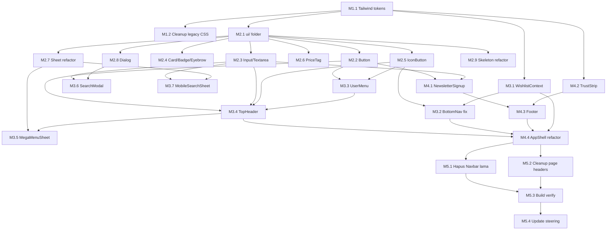

# Implementation Plan: Design Foundation

## Overview

Fase pertama dari 4 fase redesign. Cakupan: design tokens + UI primitives + Navigation + Footer.

**Total tasks**: 23 task dalam 5 milestone.
**Estimasi total**: ~32–40 jam.

## Tasks

---

## Milestone 1: Design Tokens & Tailwind Setup

Pondasi paling dasar. Wajib selesai sebelum task lain dimulai.

### Task M1.1: Update Tailwind config dengan design tokens
- **Status**: COMPLETED
- **Priority**: Critical
- **Estimasi**: 2 jam
- **Dependencies**: None
- **Files**: `tailwind.config.ts` (MODIFY), `app/globals.css` (MODIFY)

#### Subtasks
1. Tambah `theme.extend.colors` dengan neutral scale (50–950), semantic colors (success, warning, error), surface aliases
2. Tambah `theme.extend.fontSize` dengan typography scale lengkap (display-1, display-2, heading-1/2/3, body-lg, body, body-sm, caption, eyebrow)
3. Tambah `theme.extend.spacing` dengan section-y aliases
4. Tambah `theme.extend.borderRadius` (none, sm, md, full) — keep existing
5. Tambah `theme.extend.transitionDuration` (fast, normal, slow)
6. Tambah `theme.extend.transitionTimingFunction` (custom cubic-bezier)
7. Tambah `theme.extend.boxShadow` (sm, md, lg untuk dark theme)
8. Definisikan CSS variables di `globals.css` untuk semua color tokens
9. Tambah `@media (prefers-reduced-motion: reduce)` global override
10. Verify: `npm run build` pass

#### Acceptance
- Class `bg-canvas`, `bg-surface-1`, `text-text-primary`, `border-subtle`, `text-eyebrow`, `duration-normal` dll. tersedia
- Token existing (`#0a0a0a`, `#dc2626`, `#262626`) tetap bisa dipakai tanpa break

---

### Task M1.2: Audit dan hapus utility legacy
- **Status**: COMPLETED
- **Priority**: Medium
- **Estimasi**: 1 jam
- **Dependencies**: M1.1
- **Files**: `app/globals.css` (MODIFY), beberapa component file (cleanup)

#### Subtasks
1. Identifikasi semua pemakaian class legacy: `bg-stripes-red`, `bg-stripes-white`, `bg-stripes-red-dense`
2. Hapus definisi class tersebut di `globals.css` HANYA jika tidak dipakai komponen yang akan disentuh di fase ini
3. Jika masih dipakai komponen yang tidak diubah di fase ini (Hero, BrandIntro, FlashSale), BIARKAN definisi tetap (akan dihapus di fase 3)
4. Document di komentar `globals.css` mana yang legacy dan jadwal cleanup-nya

#### Acceptance
- Build pass
- Tidak ada component yang break

---

## Milestone 2: UI Primitive Components

Bisa diparalelkan dengan Milestone 3 setelah M1.1 selesai. Tapi rekomendasi: selesaikan dulu karena dipakai semua komponen nav/footer.

### Task M2.1: Setup folder `components/ui/` dan barrel export
- **Status**: COMPLETED
- **Priority**: Critical
- **Estimasi**: 0.5 jam
- **Dependencies**: M1.1
- **Files**: `components/ui/index.ts` (NEW)

#### Subtasks
1. Buat folder `components/ui/`
2. Buat `components/ui/index.ts` sebagai barrel export (kosong dulu, isi seiring komponen jadi)

---

### Task M2.2: Button component
- **Status**: COMPLETED
- **Priority**: Critical
- **Estimasi**: 2 jam
- **Dependencies**: M2.1
- **Files**: `components/ui/Button.tsx` (NEW)

#### Subtasks
1. Buat `Button.tsx` dengan props sesuai design.md section 3.7
2. Implement variants: primary, secondary, ghost, destructive
3. Implement sizes: sm (32px), md (44px), lg (56px)
4. Implement states: default, hover, active, disabled, loading (dengan spinner)
5. Support `leftIcon`, `rightIcon`, `fullWidth`, `asChild` props
6. Implement keyboard focus visible
7. Export dari `components/ui/index.ts`
8. Manual test: render semua variant × size × state di halaman dev

#### Acceptance
- Semua variant render benar
- Loading state replace leftIcon dengan spinner
- Disabled state visual + cursor-not-allowed
- Focus visible ring brand-red

---

### Task M2.3: Input & Textarea component
- **Status**: COMPLETED
- **Priority**: Critical
- **Estimasi**: 1.5 jam
- **Dependencies**: M2.1
- **Files**: `components/ui/Input.tsx` (NEW), `components/ui/Textarea.tsx` (NEW)

#### Subtasks
1. Buat `Input.tsx` extending HTMLInputElement props
2. Support label, error, hint, leftIcon, rightIcon, size (md/lg)
3. Error state visual (border error-500, text error-500 di hint)
4. Forward ref untuk integration dengan form library
5. Buat `Textarea.tsx` dengan API mirip (tanpa size param, gunakan rows)
6. Export dari `index.ts`

#### Acceptance
- Label ber-aria-labelledby
- Error state ber-aria-invalid + aria-describedby
- Focus border brand-red

---

### Task M2.4: Card, Badge, Eyebrow component
- **Status**: COMPLETED
- **Priority**: High
- **Estimasi**: 1.5 jam
- **Dependencies**: M2.1
- **Files**: `components/ui/Card.tsx` (NEW), `components/ui/Badge.tsx` (NEW), `components/ui/Eyebrow.tsx` (NEW)

#### Subtasks
1. Card: variants default/elevated/outlined, padding none/sm/md/lg
2. Badge: variants default/promo/new/success/warning, sizes sm/md
3. Eyebrow: simple component dengan default neutral / red color
4. Export semua dari `index.ts`

---

### Task M2.5: IconButton component
- **Status**: COMPLETED
- **Priority**: High
- **Estimasi**: 1 jam
- **Dependencies**: M2.1
- **Files**: `components/ui/IconButton.tsx` (NEW)

#### Subtasks
1. Buat IconButton dengan sizes sm/md/lg
2. Variants: ghost, solid, outline
3. Support badge prop (untuk cart count, wishlist count)
4. Required `aria-label` prop (TypeScript enforce via type)
5. Pastikan ukuran sm (32×32) tetap punya tap area 44×44 via wrapper padding

---

### Task M2.6: PriceTag component
- **Status**: COMPLETED
- **Priority**: High
- **Estimasi**: 1 jam
- **Dependencies**: M2.1
- **Files**: `components/ui/PriceTag.tsx` (NEW)

#### Subtasks
1. Format IDR via Intl.NumberFormat
2. Sizes: md (16/18), lg (24/28), xl (32/36) — mobile/desktop
3. Auto-show original price coret jika `originalPrice > price`
4. Optional `showDiscountBadge` prop untuk render badge -X%
5. Tabular-nums + tracking-tight

---

### Task M2.7: Sheet component refactor
- **Status**: COMPLETED
- **Priority**: Critical
- **Estimasi**: 3 jam
- **Dependencies**: M2.1
- **Files**: `components/ui/Sheet.tsx` (NEW, sourced dari `components/Sheet.tsx`), `components/Sheet.tsx` (DELETE setelah migration), `components/CartDrawer.tsx` (UPDATE import), `components/MobileSearchSheet.tsx` (UPDATE import), `components/MobileFilterSheet.tsx` (UPDATE import)

#### Subtasks
1. Pindah `components/Sheet.tsx` ke `components/ui/Sheet.tsx`
2. Refactor API: tambah prop `side` ("bottom" | "right" | "fullscreen"), `size` ("sm" | "md" | "lg" | "full")
3. Tetap support `title`, `children`, optional `footer` slot
4. Implement: backdrop blur, swipe-to-close di mobile bottom sheet, ESC to close, body scroll lock, focus trap, return focus on close
5. Update semua import: CartDrawer, MobileSearchSheet, MobileFilterSheet pakai path baru
6. Delete file lama `components/Sheet.tsx`
7. Verify: cart drawer, search sheet, filter sheet masih berfungsi

#### Acceptance
- Backward compatible untuk usage existing
- Swipe-to-close di mobile bekerja (threshold 80px)
- ESC menutup sheet
- Body tidak scroll saat sheet open

---

### Task M2.8: Dialog component
- **Status**: COMPLETED
- **Priority**: Medium
- **Estimasi**: 1.5 jam
- **Dependencies**: M2.1
- **Files**: `components/ui/Dialog.tsx` (NEW)

#### Subtasks
1. Modal centered max-w-md/lg responsive
2. Backdrop, ESC to close, focus trap (mirip Sheet)
3. Optional title, footer slot
4. Untuk dipakai size guide, konfirmasi delete, dll. (akan dipakai fase 2-3)

---

### Task M2.9: Skeleton component refactor
- **Status**: COMPLETED
- **Priority**: Medium
- **Estimasi**: 1 jam
- **Dependencies**: M2.1
- **Files**: `components/ui/Skeleton.tsx` (NEW, sourced dari `components/Skeleton.tsx`), `components/Skeleton.tsx` (DELETE), `components/SkeletonCard.tsx` (UPDATE import), `components/SkeletonBanner.tsx` (UPDATE import)

#### Subtasks
1. Pindah Skeleton ke `components/ui/Skeleton.tsx`
2. Pakai design tokens baru untuk gradient
3. Respect prefers-reduced-motion (disable animation)
4. Update import di SkeletonCard, SkeletonBanner
5. Delete file lama

---

## Milestone 3: Navigation System

Bisa mulai paralel dengan M2 setelah M1 selesai, tapi UI primitives harus siap sebelum komponen nav final di-test.

### Task M3.1: WishlistContext + halaman wishlist placeholder
- **Status**: COMPLETED
- **Priority**: High
- **Estimasi**: 2 jam
- **Dependencies**: M1.1
- **Files**: `contexts/WishlistContext.tsx` (NEW), `app/wishlist/page.tsx` (NEW)

#### Subtasks
1. Buat `WishlistContext.tsx` dengan API sesuai design.md
2. Persistence via localStorage key `nxty:wishlist`
3. Hydration pattern (flag `hydrated`) untuk SSR safety
4. Provider component `WishlistProvider`
5. Hook `useWishlist()`
6. Buat halaman `app/wishlist/page.tsx`:
   - List item wishlist sederhana (gambar 64×64 + nama + harga + remove button + link ke detail)
   - Empty state dengan CTA "Mulai Belanja" → `/`
   - Pakai Card primitive
7. Verify: tambah/hapus item di console, refresh, item tetap ada

---

### Task M3.2: BottomNav refactor + fix bug routing Akun
- **Status**: COMPLETED
- **Priority**: Critical
- **Estimasi**: 2.5 jam
- **Dependencies**: M2.5 (IconButton), M3.1 (WishlistContext)
- **Files**: `components/BottomNav.tsx` (REFACTOR & MOVE), `components/navigation/BottomNav.tsx` (NEW position)

#### Subtasks
1. Pindah `components/BottomNav.tsx` ke `components/navigation/BottomNav.tsx`
2. Update items: Beranda, Belanja, Wishlist, Keranjang, Akun (5 tab, hilangkan Cari)
3. Tab Belanja: action openMegaMenu() (sementara console.log, akan dihubungkan di M3.5)
4. Tab Wishlist: link `/wishlist`, badge dari WishlistContext
5. Tab Akun: dynamic href berdasarkan auth state
   - Use existing `getCurrentUser` dari `@/lib/supabase/customer`
   - Pattern: state `userHref` initial `/masuk`, useEffect set ke `/akun` jika user ada
6. Label mixed case ("Beranda" bukan "BERANDA")
7. Active indicator: dot 4×4 brand-red di bawah icon (bukan bar)
8. Border-top neutral-800 (bukan brand-red 2px)
9. Update import di file yang masih reference `@/components/BottomNav`
10. Hide logic berdasarkan pathname (admin, checkout, payment)
11. Verify: tab Akun routing benar untuk guest dan logged-in user

#### Acceptance
- Bug routing Akun resolved
- Tab Cari hilang
- Tab Wishlist baru dengan badge yang berfungsi
- Visual labels mixed case
- BottomNav hidden di /checkout, /payment/*, /admin/*

---

### Task M3.3: UserMenu component (extracted)
- **Status**: COMPLETED
- **Priority**: High
- **Estimasi**: 1.5 jam
- **Dependencies**: M2.2 (Button), M2.5 (IconButton)
- **Files**: `components/navigation/UserMenu.tsx` (NEW)

#### Subtasks
1. Extract logic UserMenu dari `Navbar.tsx` lama
2. Pakai dropdown pattern (relative + absolute panel)
3. Click outside to close (backdrop transparent fixed)
4. Items:
   - Guest: 1 link "Masuk"
   - Logged in: header "Login sebagai email" + Akun + Pesanan + Alamat + (border) + Logout
5. Pakai Button/IconButton primitives baru
6. Refactor visual (mixed case, tracking normal, pakai tokens)

---

### Task M3.4: TopHeader component baru
- **Status**: COMPLETED
- **Priority**: Critical
- **Estimasi**: 4 jam
- **Dependencies**: M2.2, M2.3, M2.5, M3.3
- **Files**: `components/navigation/TopHeader.tsx` (NEW)

#### Subtasks
1. Buat `TopHeader.tsx`
2. Mobile layout (56px):
   - Logo 32×32 kiri (link ke `/`)
   - Search field persisten tengah (pakai Input md dengan leftIcon Search)
     - Click → buka MobileSearchSheet via UIContext (sementara console.log, akan hook di task selanjutnya)
   - IconButton Cart kanan dengan badge dari CartContext, click → openCart
3. Desktop layout (72px):
   - Logo full kiri
   - Nav links tengah: Belanja (hover dropdown MegaMenu), Promo (link `/promo`), Cerita (link `/tentang-kami`), Kontak (link `/kontak`)
   - IconButton search → buka SearchModal (placeholder)
   - IconButton wishlist → link `/wishlist`, badge
   - UserMenu trigger
   - IconButton cart → openCart, badge
4. Sticky top + backdrop-blur saat scroll
5. Auto-hide on scroll down > 80px, show on scroll up
   - Skip auto-hide jika halaman pendek (scrollHeight < 2 × viewport)
6. Hilangkan marquee
7. Hilangkan hamburger menu (mobile pakai BottomNav)
8. Manual test: navigasi semua halaman, scroll behavior, search tap di mobile

#### Acceptance
- Mobile tinggi 56px tanpa marquee
- Search persisten langsung tappable
- Cart badge sync dengan CartContext
- Auto-hide bekerja sesuai threshold
- Desktop dropdown UserMenu berfungsi

---

### Task M3.5: MegaMenuSheet component
- **Status**: COMPLETED
- **Priority**: High
- **Estimasi**: 2.5 jam
- **Dependencies**: M2.7 (Sheet), M3.4 (TopHeader)
- **Files**: `components/navigation/MegaMenuSheet.tsx` (NEW), `contexts/UIContext.tsx` (MODIFY)

#### Subtasks
1. Tambah `openMegaMenu`, `closeMegaMenu`, `isMegaMenuOpen` di UIContext
2. Mobile: Sheet `side="bottom" size="full"`
3. Desktop: dropdown panel di bawah TopHeader (controllable via prop, fallback Sheet)
4. Struktur:
   - "Lihat Semua Produk" item paling atas (link `/`)
   - List 13 kategori dengan thumbnail (ambil produk pertama per kategori dari products.json sebagai placeholder)
   - "Promo Aktif" item paling bawah (link `/promo`)
5. Tap row → navigate, close menu
6. Hook ke BottomNav tab Belanja (call openMegaMenu)
7. Hook ke TopHeader desktop nav (hover/click trigger)

---

### Task M3.6: SearchModal component (desktop)
- **Status**: COMPLETED
- **Priority**: Medium
- **Estimasi**: 2 jam
- **Dependencies**: M2.3 (Input), M2.8 (Dialog)
- **Files**: `components/navigation/SearchModal.tsx` (NEW), `contexts/UIContext.tsx` (MODIFY)

#### Subtasks
1. Tambah `openSearchModal`, `closeSearchModal` di UIContext
2. Modal full-screen max-w-720 centered top
3. Input besar autofocus
4. Section Pencarian Populer (chip dari `["Sarung Tinju", "Hand Wrap", "Matras", "Deker"]`)
5. Section Hasil real-time (debounce 200ms, filter products.json client-side)
6. Empty state
7. Hook ke TopHeader desktop search icon

---

### Task M3.7: MobileSearchSheet refactor & move
- **Status**: COMPLETED
- **Priority**: High
- **Estimasi**: 1 jam
- **Dependencies**: M2.3 (Input), M2.7 (Sheet)
- **Files**: `components/MobileSearchSheet.tsx` (MOVE & REFACTOR) → `components/navigation/MobileSearchSheet.tsx`

#### Subtasks
1. Pindah file ke folder navigation
2. Refactor pakai Input primitive dan Button primitive
3. Hilangkan font-mono, uppercase tracking lebar
4. Update import di semua referensi
5. Hook ke TopHeader mobile search field (tap → open this sheet, focus input)

---

## Milestone 4: Footer & AppShell

### Task M4.1: NewsletterSignup component
- **Status**: COMPLETED
- **Priority**: Medium
- **Estimasi**: 1.5 jam
- **Dependencies**: M2.2 (Button), M2.3 (Input)
- **Files**: `components/NewsletterSignup.tsx` (NEW), `app/api/newsletter/subscribe/route.ts` (NEW stub)

#### Subtasks
1. Component dengan props title, description, layout (stacked/inline)
2. Input email + Button "Berlangganan"
3. State idle/submitting/success/error
4. Validasi email client-side
5. Submit POST ke `/api/newsletter/subscribe`
6. Endpoint stub: terima email, validate, return `{ ok: true }` (TODO integrate dengan email service nanti)

---

### Task M4.2: TrustStrip component
- **Status**: COMPLETED
- **Priority**: Medium
- **Estimasi**: 0.5 jam
- **Dependencies**: M1.1
- **Files**: `components/TrustStrip.tsx` (NEW)

#### Subtasks
1. Component dengan props items (icon + label) dan variant (default/compact)
2. 3 item horizontal, responsive
3. Pakai di footer dan akan dipakai di fase 2 (product detail, checkout)

---

### Task M4.3: Footer multi-kolom
- **Status**: COMPLETED
- **Priority**: High
- **Estimasi**: 4 jam
- **Dependencies**: M4.1 (NewsletterSignup), M4.2 (TrustStrip)
- **Files**: `components/Footer.tsx` (NEW)

#### Subtasks
1. Buat `Footer.tsx` dengan layout responsive
2. Desktop: 5 kolom grid (Brand, Belanja, Bantuan, Perusahaan, Newsletter)
3. Mobile: Brand always visible + 3 accordion (Belanja, Bantuan, Perusahaan) + Newsletter section
4. Internal subcomponents: FooterColumn, FooterAccordion
5. Strip bawah:
   - SocialLinks: Instagram, TikTok, YouTube (IconButton lg, 44×44)
   - PaymentLogos: scroll horizontal di mobile dengan fade edge (BCA, BNI, Mandiri, GoPay, OVO, DANA, ShopeePay, QRIS, COD — pakai placeholder SVG/text dulu jika asset belum ada)
   - Legal: Privacy, Terms, Refund Policy + Copyright
6. Pakai design tokens baru, hindari `bg-stripes-red`
7. Manual test mobile dan desktop

#### Acceptance
- Mobile accordion expand/collapse smooth
- Desktop 5 kolom proporsional
- Newsletter signup berfungsi
- Social icons tap target 44×44
- Payment logos overflow gracefully di mobile

---

### Task M4.4: AppShell refactor
- **Status**: COMPLETED
- **Priority**: Critical
- **Estimasi**: 2 jam
- **Dependencies**: M3.4 (TopHeader), M3.2 (BottomNav), M4.3 (Footer), M3.1 (WishlistProvider)
- **Files**: `components/AppShell.tsx` (MODIFY), `app/layout.tsx` (MODIFY untuk WishlistProvider)

#### Subtasks
1. Tambah WishlistProvider di `app/layout.tsx` sejajar dengan CartProvider
2. Refactor `AppShell.tsx`:
   - Detect route via `usePathname()`
   - `isAdmin`, `isCheckoutFlow` flags
   - Render TopHeader untuk route non-admin
   - Render BottomNav untuk route non-admin AND non-checkout-flow
   - Render Footer untuk route non-admin AND non-checkout-flow
   - Wrap overlay layer: CartDrawer, MegaMenuSheet, SearchModal, MobileSearchSheet, Toaster
3. Hapus `Navbar` import di page-level (home, promo, cart, dll) — AppShell sudah handle
4. Hapus footer inline di `app/page.tsx`
5. Verify: semua halaman publik render TopHeader + Footer + BottomNav (kecuali checkout/payment/admin)

#### Acceptance
- Home, Promo, Cart, Tentang, Kontak: ada TopHeader + Footer + BottomNav
- Checkout, Payment success/pending/failed: ada TopHeader, NO BottomNav, NO Footer
- Admin: tidak ada TopHeader/BottomNav/Footer (admin layout sendiri)

---

## Milestone 5: Cleanup & Migration

### Task M5.1: Hapus Navbar lama
- **Status**: COMPLETED
- **Priority**: High
- **Estimasi**: 1.5 jam
- **Dependencies**: M4.4
- **Files**: `components/Navbar.tsx` (DELETE), semua file yang import Navbar (MODIFY)

#### Subtasks
1. Search semua usage `@/components/Navbar` di codebase
2. Hapus import dan render `<Navbar />` di:
   - `app/page.tsx`
   - `app/promo/page.tsx`
   - `app/cart/page.tsx`
   - file lain yang import
3. Pastikan AppShell handle nav untuk page tersebut
4. Delete `components/Navbar.tsx`
5. Verify: `npm run build` + `npx tsc --noEmit` pass

---

### Task M5.2: Cleanup index card numbering & font-mono di header pages
- **Status**: DEFERRED
- **Priority**: Medium
- **Estimasi**: 1 jam
- **Dependencies**: M4.4
- **Files**: `app/cart/page.tsx`, `app/promo/page.tsx`, headers internal page

#### Subtasks
1. Di page-level header (mis. cart, promo, tentang, kontak), update visual:
   - Hapus `font-mono` untuk title
   - Hapus uppercase tracking 0.2em+
   - Pakai heading-2 tokens
2. JANGAN sentuh body content (akan diredesign di fase 2-4)
3. JANGAN sentuh ProductCard, FlashSale, BrandIntro (fase 3)

#### Catatan deferred
Setelah AppShell refactor, halaman cart/promo/tentang/kontak punya sticky header internal yang akan double-stack dengan TopHeader. Karena halaman-halaman ini semua dijadwalkan untuk diredesign menyeluruh di fase 2 (cart) dan fase 4 (tentang/kontak), saya defer cleanup di sini. Cosmetic only — tidak break fungsionalitas.

---

### Task M5.3: Build, typecheck, lint verification
- **Status**: COMPLETED
- **Priority**: Critical
- **Estimasi**: 1 jam
- **Dependencies**: M5.1, M5.2
- **Files**: None (verification)

#### Subtasks
1. Run `npm run build` — must SUCCESS
2. Run `npx tsc --noEmit` — must zero errors
3. Run `npx eslint . --max-warnings 0` di file-file BARU yang dibuat (UI primitives, navigation, Footer, NewsletterSignup, TrustStrip, WishlistContext, wishlist page)
4. Manual smoke test di dev mode (`npm run dev`):
   - Buka semua halaman publik utama
   - Verify nav, footer, BottomNav render benar
   - Verify cart drawer, search, mega menu berfungsi
   - Verify tab Akun routing benar (test logged in dan guest)
   - Verify checkout flow nav hidden
5. Document hasil verification di catatan task

#### Acceptance
- Build SUCCESS
- Typecheck zero errors
- File baru lulus eslint
- Smoke test pass semua

---

### Task M5.4: Update steering doc (opsional, di akhir)
- **Status**: COMPLETED
- **Priority**: Low
- **Estimasi**: 0.5 jam
- **Dependencies**: M5.3
- **Files**: `.kiro/steering/NXTY Fightwear Workspace.md` (MODIFY)

#### Subtasks
1. Tambah section "Design System Tokens" sebagai referensi cepat tim
2. List komponen UI primitives yang tersedia di `components/ui/`
3. Aturan pakai brand-red (CTA only, bukan utility)

---

## Task Dependency Graph

Tasks dikelompokkan dalam wave (gelombang eksekusi paralel). Setiap wave bisa dikerjakan setelah wave sebelumnya selesai. Dalam satu wave, task tidak punya saling dependency.

```json
{
  "waves": [
    {
      "id": 1,
      "name": "Foundation Tokens",
      "tasks": ["M1.1"],
      "description": "Setup design tokens di Tailwind dan globals.css. Pondasi paling dasar."
    },
    {
      "id": 2,
      "name": "UI Primitives + Wishlist + Cleanup",
      "tasks": ["M1.2", "M2.1", "M2.2", "M2.3", "M2.4", "M2.5", "M2.6", "M2.7", "M2.8", "M2.9", "M3.1", "M4.2"],
      "description": "Bangun semua UI primitives, WishlistContext, TrustStrip. Bisa diparalelkan sebagian. M2.1 (folder setup) ringan dan jadi entry point ke semua M2.x."
    },
    {
      "id": 3,
      "name": "Navigation Core",
      "tasks": ["M3.2", "M3.3"],
      "description": "Refactor BottomNav (fix bug routing Akun) dan extract UserMenu. Critical bug fix dilakukan di sini."
    },
    {
      "id": 4,
      "name": "Top Header + Overlays + Newsletter",
      "tasks": ["M3.4", "M3.5", "M3.6", "M3.7", "M4.1"],
      "description": "Bangun TopHeader baru dan komponen overlay (MegaMenu, SearchModal, MobileSearchSheet). Newsletter signup paralel."
    },
    {
      "id": 5,
      "name": "Footer + AppShell Integration",
      "tasks": ["M4.3", "M4.4"],
      "description": "Bangun Footer multi-kolom dan refactor AppShell untuk wire semua komponen baru."
    },
    {
      "id": 6,
      "name": "Cleanup + Verification",
      "tasks": ["M5.1", "M5.2", "M5.3", "M5.4"],
      "description": "Hapus Navbar lama, cleanup page headers, build/typecheck verify, update steering doc."
    }
  ]
}
```

### Visual Dependency Diagram



## Notes

### Saran Eksekusi

### Day 1 (Tokens + UI Primitives wave 1)
- M1.1, M1.2 (foundation)
- M2.1, M2.2, M2.3, M2.4, M2.5, M2.6 (primitives ringan)

### Day 2 (Primitives wave 2 + Wishlist)
- M2.7, M2.8, M2.9 (sheet/dialog/skeleton)
- M3.1 (WishlistContext + page placeholder)

### Day 3 (Navigation core)
- M3.2 (BottomNav fix — critical bug fix)
- M3.3 (UserMenu)
- M3.4 (TopHeader)

### Day 4 (Navigation overlays + Footer)
- M3.5 (MegaMenuSheet)
- M3.6, M3.7 (Search modal & sheet)
- M4.1, M4.2 (NewsletterSignup, TrustStrip)

### Day 5 (Integration + cleanup)
- M4.3 (Footer)
- M4.4 (AppShell refactor)
- M5.1, M5.2 (cleanup Navbar lama, page header cleanup)
- M5.3 (verification)
- M5.4 (steering doc update)

Total: ~5 hari kerja efektif untuk satu developer, atau 2–3 hari jika UI primitives diparalelkan oleh dua orang.

### Kriteria "Done" untuk Fase 1

Spec ini dianggap selesai ketika:

1. ✅ Semua task M1–M5 status DONE
2. ✅ Build + typecheck pass tanpa error baru
3. ✅ Bug routing tab Akun di BottomNav resolved
4. ✅ TopHeader baru render di semua halaman publik tanpa marquee
5. ✅ Footer baru render di halaman publik (kecuali checkout/payment/admin)
6. ✅ BottomNav baru render dengan 5 tab benar dan hidden di flow checkout
7. ✅ UI primitives bisa di-import dari `@/components/ui` untuk dipakai fase berikutnya
8. ✅ Visual regression check manual: halaman existing (homepage, product detail, cart, dll) masih render tanpa visual broken (page content boleh masih lama)
9. ✅ Smoke test: cart drawer, search, mega menu, wishlist, login/logout flow semua berfungsi
10. ✅ Setelah selesai, lanjut ke spec fase 2: `checkout-flow-redesign`
